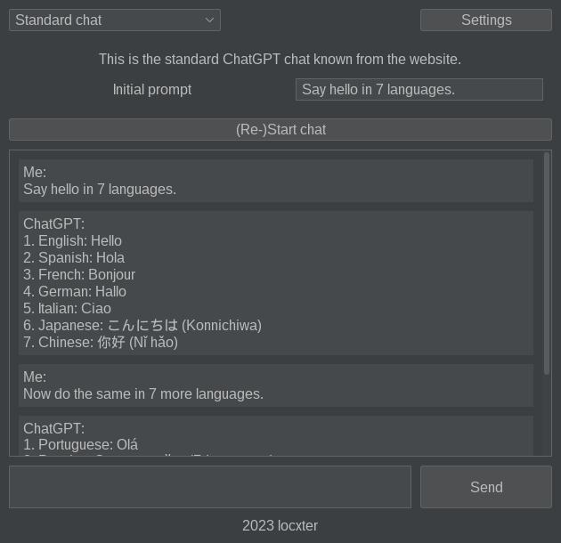

# chtgpttlbx

## Overview

> Please keep in mind that this an early **work in progress**.

This is a GUI ChatGPT toolbox, which is meant to make performing the same operations over and over as simple as possible. It's feature set is currently quite limited, but can easily be expanded by third-party contributions through its easy to use programming interface - so feel free to make a merge request, if you are missing a tool.

## Tools

- Standard chat: The standard ChatGPT chat known from the website

- Overview creator: A topic overview creator in Markdown syntax

- Presentation creator: A presentation creator in Markdown format

Thanks to the amazing Markdown slides provided by [CryptPad](https://cryptpad.fr/), the finished presentation looks like this:

You can also take a look at the PDF file `presentation.pdf`, but it sadly is in DIN A4 format.
- Text summarizer: A text summarizer in Markdown syntax

- Video summarizer: This is a YouTube video summarizer in Markdown syntax (TODO)
- More to come...

## Dependencies

I generally try to minimize dependencies, but I'm a one man crew and can therefore only support Debian-based Linux distributions as I'm running one myself. Anyway, you need to have the following packages installed for everything to work properly:

- SDKMAN! for managing all the JVM dependencies. Install it via the [installation guide](https://sdkman.io/install).
- JDK for running the bytecode. Install it with `sdk install java`.
- Kotlin for developing the program. Install it with `sdk install kotlin`.
- Gradle for building the whole thing. Install it with `sdk install gradle`.

## How to use it

Build the JAR via `gladle clean standalone` and then run it via `java -jar build/libs/chtgpttlbx-ng-1.0-standalone.jar`. You will also need to enter your own OpenAI key on first launch, in order to start a chat and make requests. If you don't already have one, you can get it from the [OpenAI developer platform](https://platform.openai.com/account/api-keys).

## How to a commit a tool

This application was built with extensibility in mind, which makes adding new tools quite a breeze. Simply create a new class in `/tools` implementing the `Tool` abstract class and add a new entry to the `ETool` enum in `/model`. A good minimal example is the standard chat tool (`StandardChat`), but feel free to reach out, if you have questions or issues. Once the new tool is working and tested, open a merge request and it I will add it to the main project shortly.
