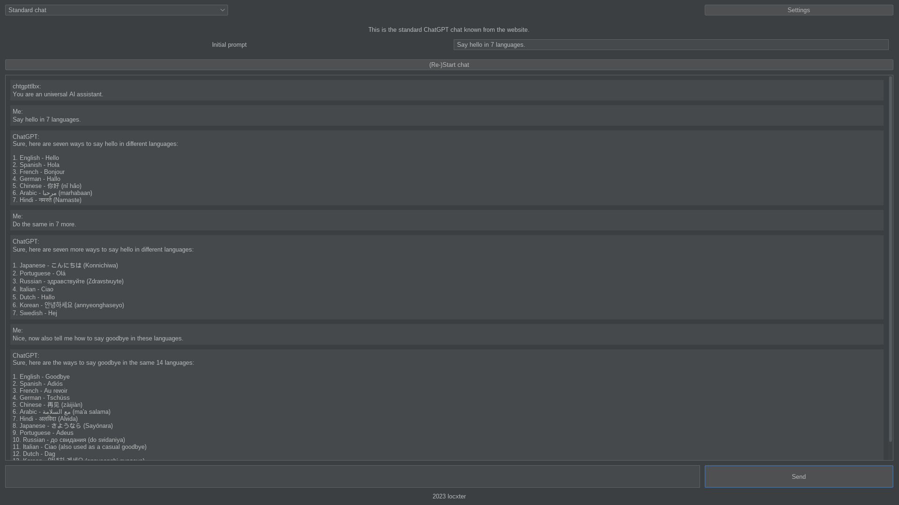
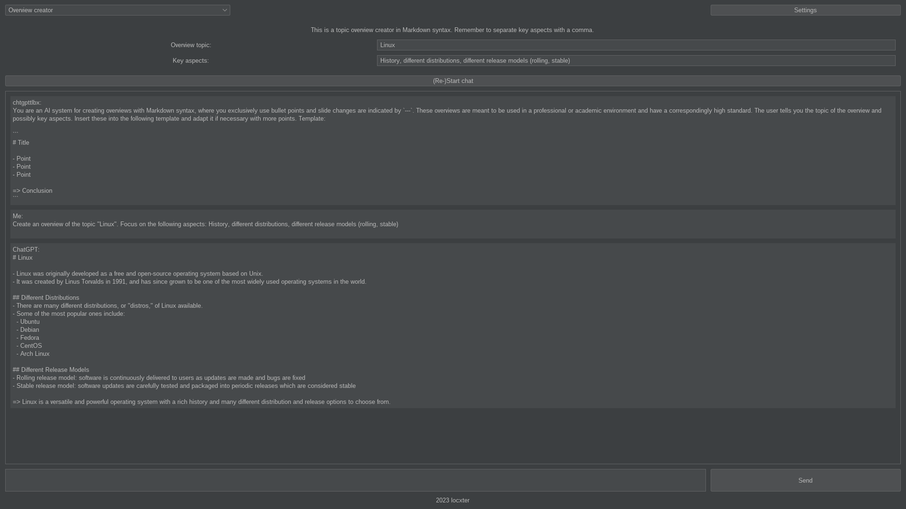
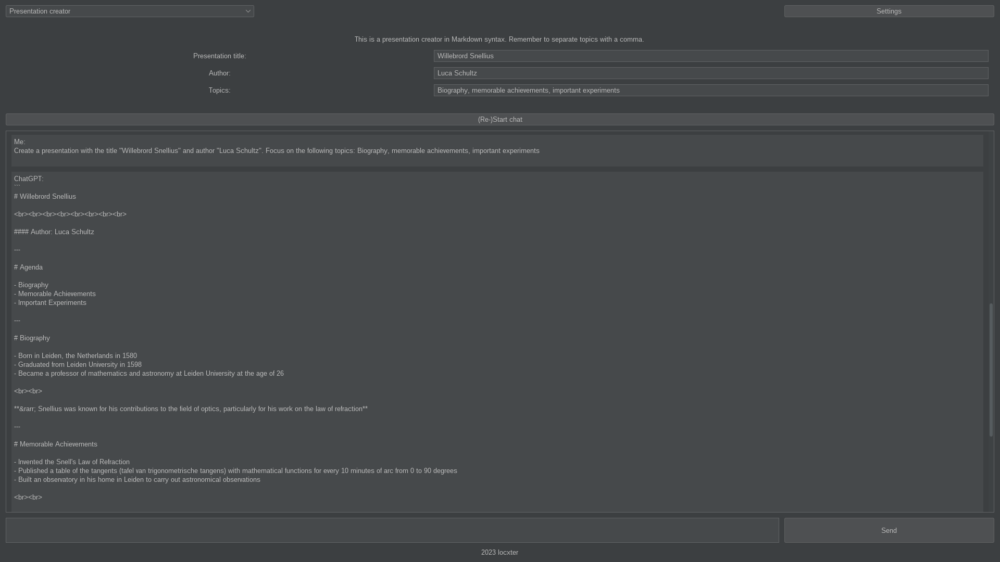
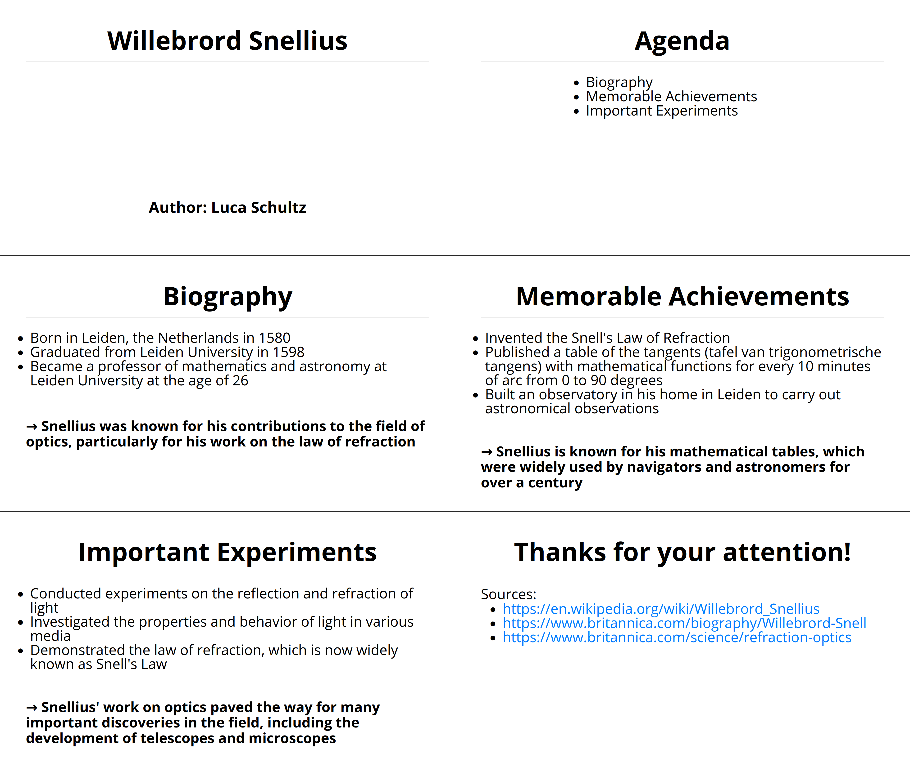
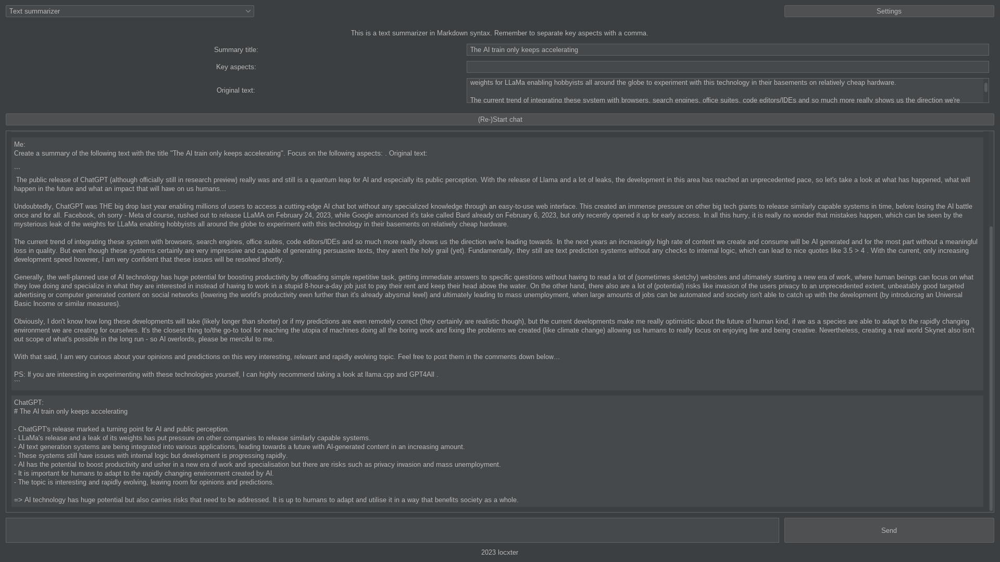
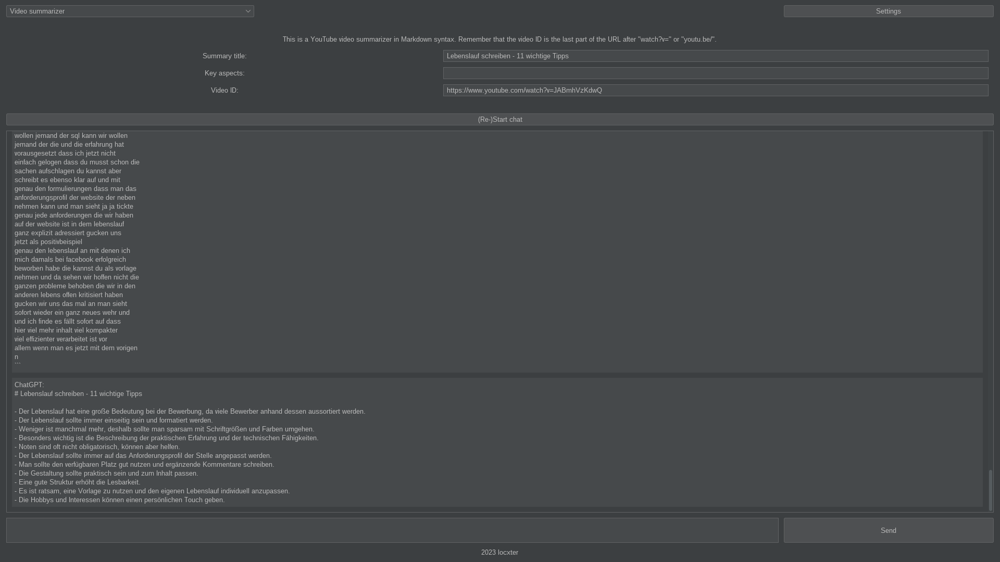
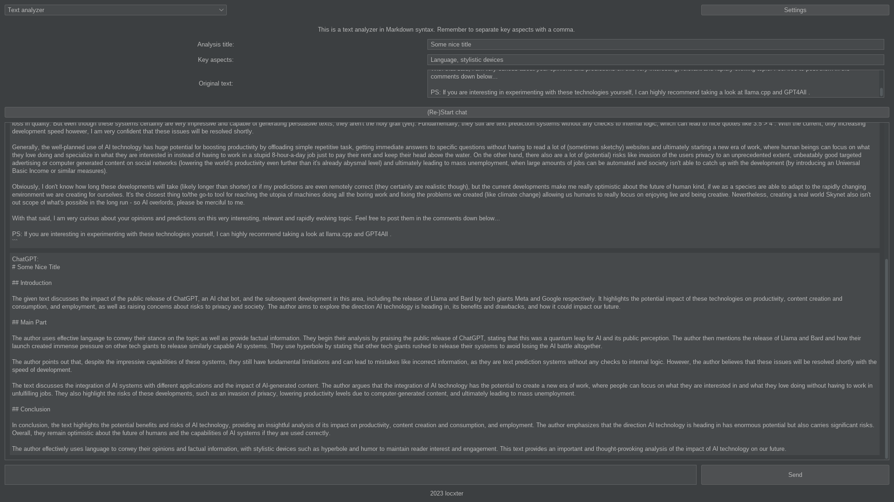
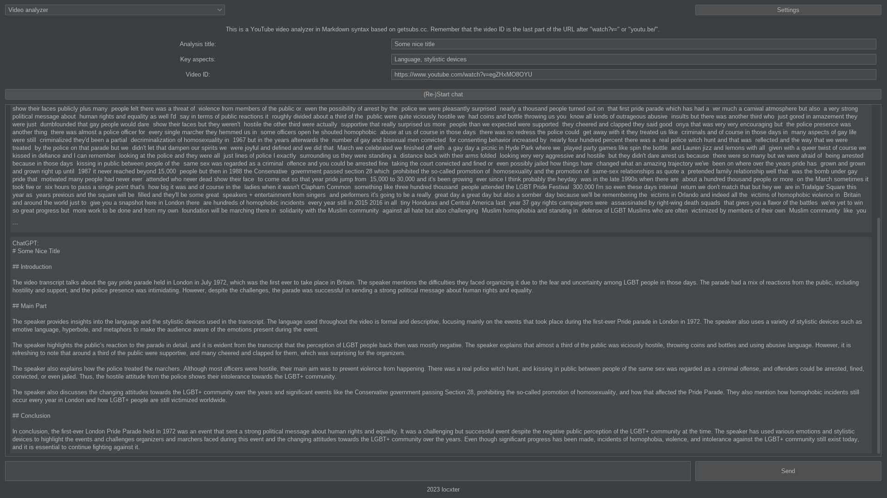

# chtgpttlbx

## Overview

> Please keep in mind that this a **work in progress**.

This is a GUI ChatGPT toolbox, which is meant to make performing the same operations over and over as simple as possible. It's feature set is currently quite limited, but can easily be expanded by third-party contributions through its easy to use programming interface - so feel free to make a merge request, if you are missing a tool.

**Prebuilt installers for Windows (.exe), Linux (.deb) and macOS (.dmg) can be found under [Releases](https://github.com/locxter/chtgpttlbx/releases).**

## Tools

- Standard chat: The standard ChatGPT chat known from the website

- Overview creator: A topic overview creator in Markdown syntax

- Presentation creator: A presentation creator in Markdown format

Thanks to the amazing Markdown slides provided by [CryptPad](https://cryptpad.fr/), the finished presentation looks like this:

You can also take a look at the PDF file `presentation.pdf`, but it sadly is in DIN A4 format.
- Text summarizer: A text summarizer in Markdown syntax

- Video summarizer: A YouTube video summarizer in Markdown syntax based on getsubs.cc

- Text analyzer: A text analyzer in Markdown syntax
  
- Video analyzer: A YouTube video analyzer in Markdown syntax based on getsubs.cc
  
- More to come...

## Dependencies

I generally try to minimize dependencies, but I'm a one man crew and can therefore only support Debian-based Linux distributions as I'm running one myself. Anyway, you need to have the following packages installed for everything to work properly:

- SDKMAN! for managing all the JVM dependencies. Install it via the [installation guide](https://sdkman.io/install).
- JDK for running the bytecode. Install it with `sdk install java`.
- Kotlin for developing the program. Install it with `sdk install kotlin`.
- Gradle for building the whole thing. Install it with `sdk install gradle`.

## How to use it

Build the JAR via `gradle clean standalone` and then run it via `java -jar build/libs/chtgpttlbx-1.0-standalone.jar`. You will also need to enter your own OpenAI key on first launch, in order to start a chat and make requests. If you don't already have one, you can get it from the [OpenAI developer platform](https://platform.openai.com/account/api-keys). Please keep in mind that the text and video summarizers are limited to 12.500 characters due to the context limitation of GPT-3.5-Turbo.

## How to a commit a tool

This application was built with extensibility in mind, which makes adding new tools quite a breeze. Simply create a new class in `/tools` implementing the `Tool` abstract class and add a new entry to the `ETool` enum in `/model`. A good minimal example is the standard chat tool (`StandardChat`), but feel free to reach out, if you have questions or issues. Once the new tool is working and tested, open a merge request and it I will add it to the main project shortly.

## How to build the native installers

Most of the needed information can be found in this excellent [Baeldung article](https://www.baeldung.com/java14-jpackage), this [Nokoriware article](https://www.nokoriware.com/blog/2021/9/12/java-using-jpackage-quick-start-guide-for-windows) and on the [docs page of jpackage](https://docs.oracle.com/en/java/javase/17/jpackage/packaging-overview.html#GUID-C1027043-587D-418D-8188-EF8F44A4C06A), but here we go. If you are on Windows, you first have to install [Wix v3](https://wixtoolset.org/docs/wix3/). If you are on Ubuntu, make sure to have `fakeroot` installed. Then build the JAR as described under `How to use it`. Finally execute one of these commands depending on your plattform to build the installer:

- Ubuntu: `jpackage --input build/ --name chtgpttlbx --main-jar libs/chtgpttlbx-1.0-standalone.jar --main-class com.github.locxter.chtgpttlbx.MainKt --type deb --linux-shortcut`
- Windows: `jpackage --input build/ --name chtgpttlbx --main-jar libs/chtgpttlbx-1.0-standalone.jar --main-class com.github.locxter.chtgpttlbx.MainKt --type exe --win-shortcut` (If `jpackage` isn't found, replace it with `& 'C:\Program Files\Java\jdk-17.0.2\bin\jpackage.exe'`, where you insert your JDK version instead of `jdk-17.0.2`.)
- macOS: `jpackage --input build/ --name chtgpttlbx --main-jar libs/chtgpttlbx-1.0-standalone.jar --main-class com.github.locxter.chtgpttlbx.MainKt --type dmg --mac-package-name chtgpttlbx`

## Credits

All ChatGPT related credits and copyright goes to OpenAI. The beautiful workbench image is courtesy of [Hal Gatewood](https://unsplash.com/photos/v7WyjiyXNr4).
